# Tutorial React Native
Tutorial membuat aplikasi mobile dengan menggunakan React Native Expo

***
## JSX
JSX atau bisa dibilang extended javascript adalah suatu pengembangan javascript dimana kode HTML bisa di ikut sertakan dalam javascript. Beberapa rekomendasi dalam JSX sebagai berikut :
- Kode HTML harus nested. Artinya harus ada 1 tag parent
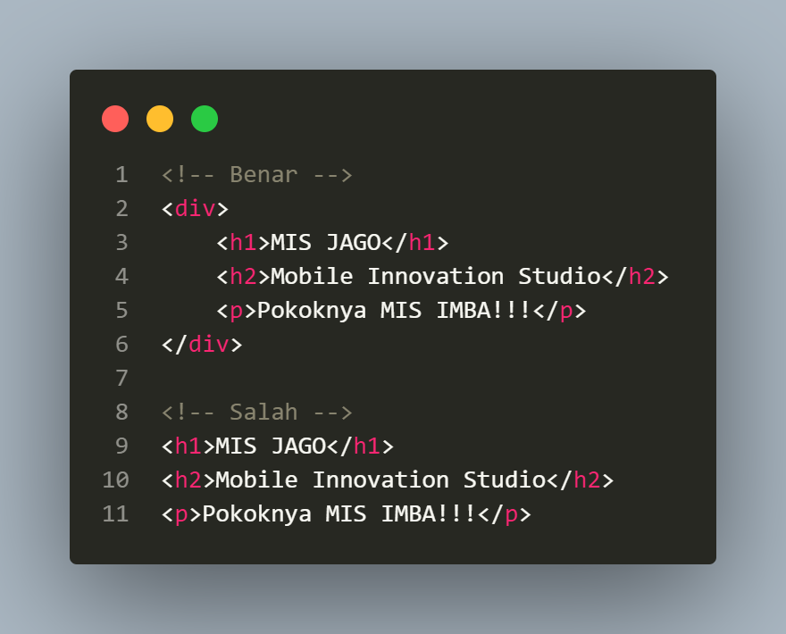
- Penulisan kode Javascript menggunakan {}
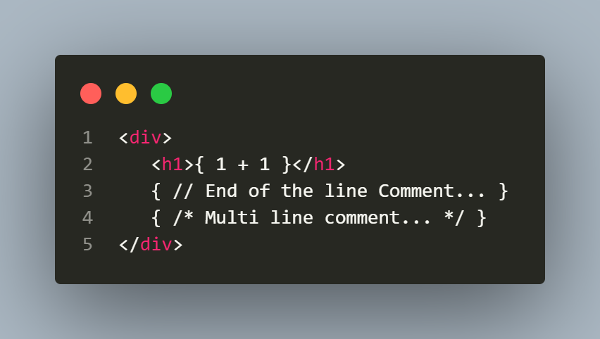
- Penulisan if else
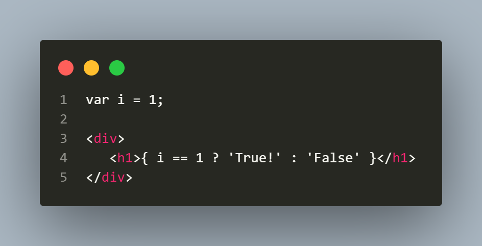
- CSS styling
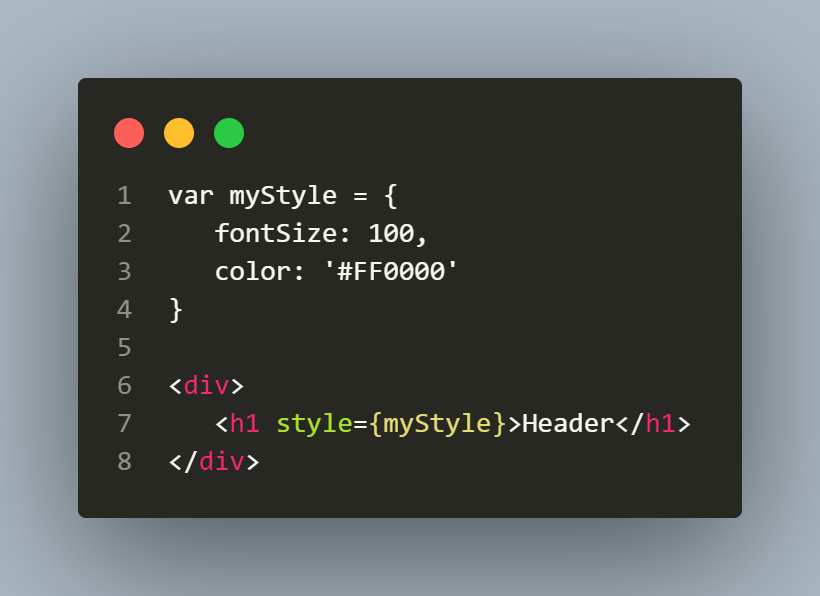
- Penulisan component react diawali huruf kapital. **TIDAK** disarankan mencoba ini
```html
<Header />
```

***
## Rendering
Rendering sangat berkaitan dengan `lifecycle React`. Metode render harus mengembalikan komponen Asli Bereaksi (elemen JSX) ke render (atau null, untuk tidak menghasilkan apa pun).
***
## Components
Komponen adalah bagian-bagian yang menyusun aplikasi. Diharus membuat komponen untuk memberitahu React tentang apa saja yang harus ditampilkan (render) ke Real DOM (HTML). [Apa itu DOM?](https://www.w3schools.com/js/js_htmldom.asp). Komponen di React sendiri bersifat `reuseable`, artinya bisa digunakan kembali.
***
### Jenis Komponen
Komponen yang dibuat dengan fungsi disebut juga dengan `function components` dan yang menggunakan class disebut `class components`. Nama komponen harus dimulai dengan huruf kapital. Fungsi harus mengembalikan JSX elemen.
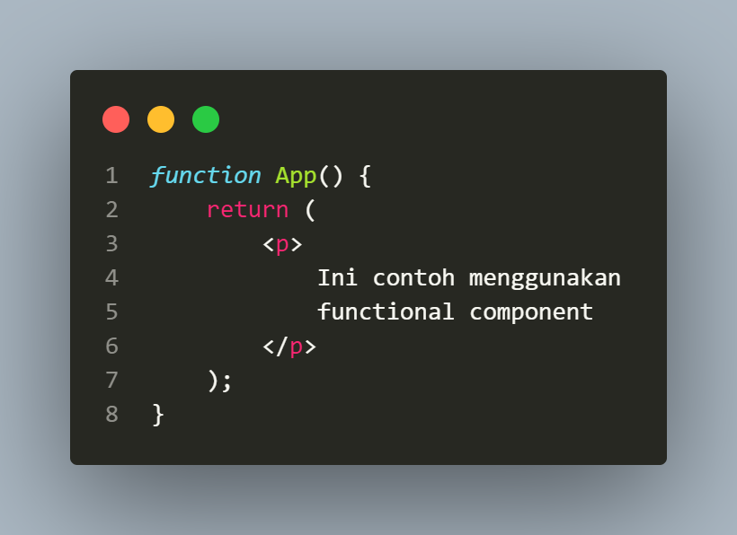
Sedangkan untuk class component, cara membuatnya harus melakukan extends dari class React.Component. Nama komponen harus dimulai dengan huruf kapital. Method render harus mengembalikan JSX elemen.
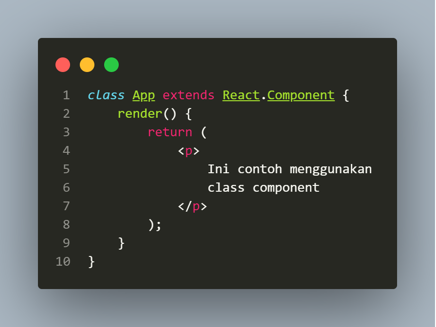
Kedua komponen di atas sebenarnya sama, bedanya di cara pembuatannya saja. Komponen pertama dibuat menggunakan fungsi dan komponen kedua menggunakan class.<br>
Pada class component, terdapat method khusus yang akan dijalankan saat class tersebut dibuat. Method tersebut adalah method constructor. Konstruktor biasanya digunakan untuk melakukan inisialisasi komponen. Konstruktur dibuat dengan fungsi `constructor()`. Di dalam konstruktor, kita bisa mendefinisikan nilai awal untuk variabel maupun state. Pemanggilan fungsi `super()` di dalam konstruktor akan mengeksekusi konstruktor dari induk class, yakni `React.Component`. Tujuannya agar kita bisa mengakses semua method yang ada di class induk.
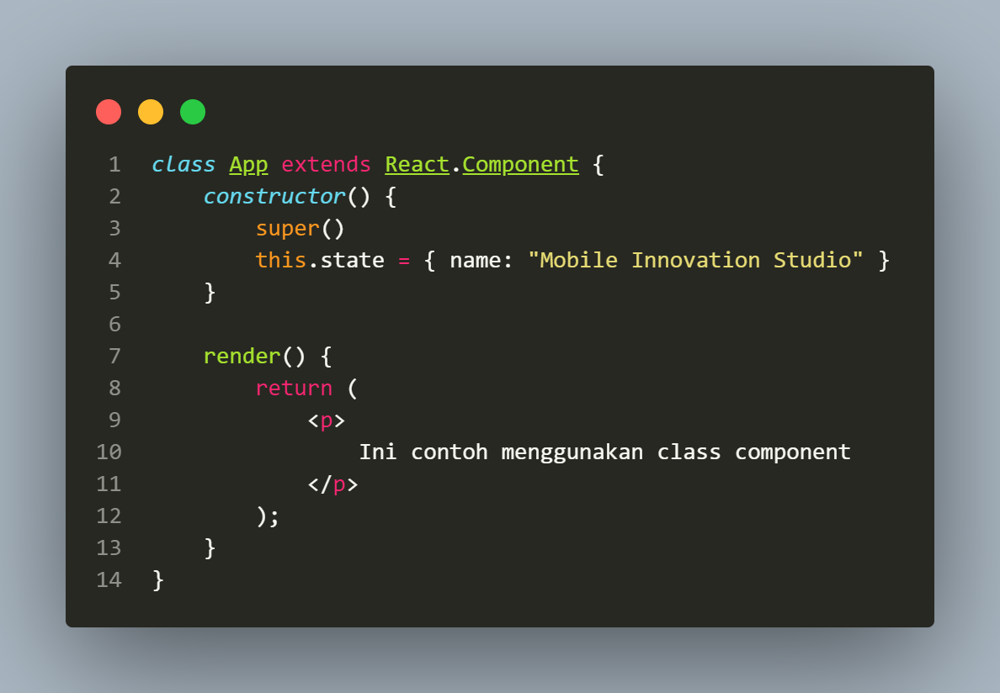
***
## Props
React Native memiliki dua tipe data yang dapat mengkontrol sebuah `component`.
`props` ditetapkan oleh `parent` dari suatu `component` tersebut dan tidak dapat diperbaiki / diganti (besifat fiex) selama masa pakai komponen. Bisa dibilang `props` adalah parameter default dari suatu `component`.

Berikut contohnya:   
Pertama Kita buat reuseable `component` dengan default props `name`  
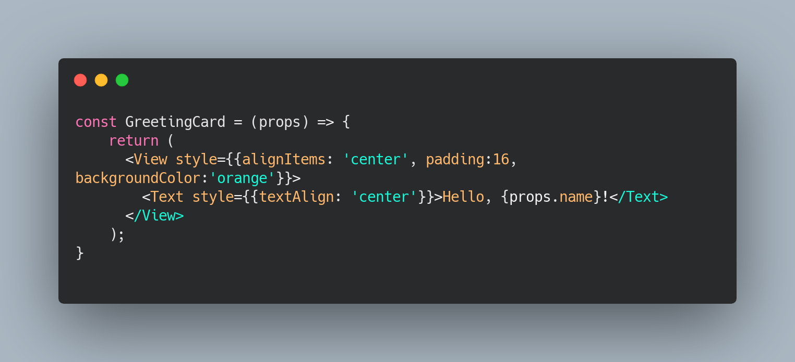  
Lalu akan kita gunakan seperti ini:   
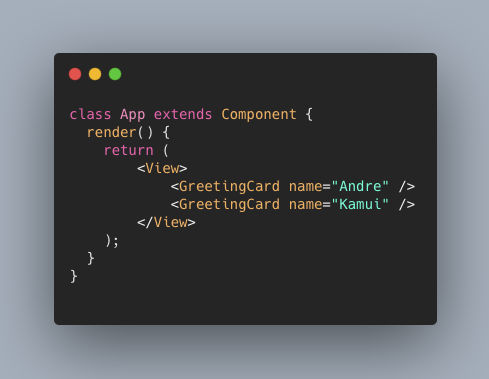  
parameter `name` yang ada dalam component `<GreetingCard />` adalah sebuah `props`

***
## State
Jika `props` bersifat `fixed` atau tidak dapat dirubah `value`nya. `state` adalah data control di dalam component yang dapat diubah.  
Deklarasi `state` dalam sebuah Functional Component seperti ini:
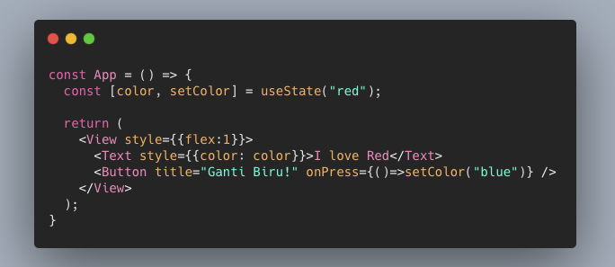  
Deklarasi `state` dalam sebuah Class Component seperti ini:
  
Dalam program tersebut sebuah tombol akan memerintah fungsi mengganti isi dari sebuah state.  

***
## Styling
Styling di React Native terdapat dua cara,   
Pertama, langsung dituliskan dalam props component:   
    
component utama (core) dari React Native pasti memiliki props `style`.  
Dua, menggunakan `StyleSheet` component:  
define dulu `styles` nya:  
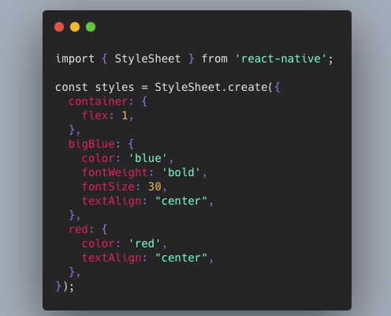    
gini cara pakenya:  
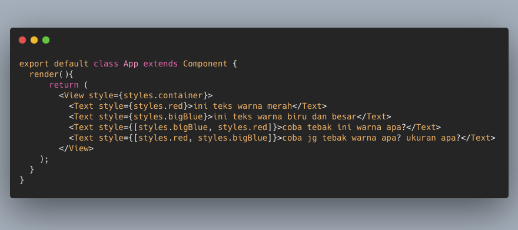    
dua kode diatas itu dalam satu file, jika ingin menjadikannya sebuah file `styles.js` sendiri maka tambahkan `export` ke konstanta `styles` :     
```js
    export const styles = StyleSheet.create({
        ...
    });
```
***
## Lifecycle

***
## Handling Event
***

Mobile Innovation Studio - 2020
